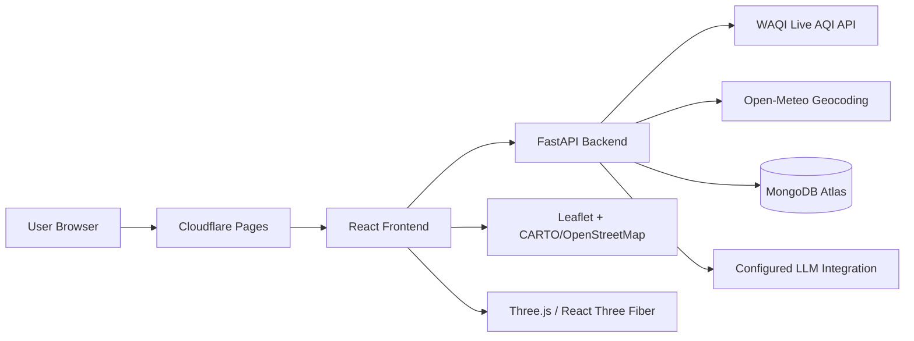

<div align="center">


<p>
  
  
  
  
  
</p>
<p>
  
  
  
  
  
  
</p>

> **A full-stack air-quality intelligence platform that turns live pollution data into understandable AQI, pollutant insights, environmental health-risk scoring, exposure guidance, forecasts and actionable precautions.**

[🚀 Live Demo](https://oxyzen1.pages.dev) &nbsp;•&nbsp; [📚 API Docs](https://oxyzen-backend-5nvw.onrender.com/docs) &nbsp;•&nbsp; [🐛 Issues](https://github.com/pranavreddy1721/oxyzen/issues)

</div>

---

## 📋 Table of Contents

- [✨ Overview](#-overview)
- [🚀 Features](#-features)
- [📡 Live AQI Data Pipeline](#-live-aqi-data-pipeline)
- [📊 AQI & Risk Model](#-aqi--risk-model)
- [🔌 API](#-api)
- [🧩 Architecture](#-architecture)
- [🛠️ Tech Stack](#️-tech-stack)
- [🗂️ Project Structure](#️-project-structure)
- [⚙️ Environment Variables](#️-environment-variables)
- [☁️ Deployment](#️-deployment)
- [💻 Getting Started](#-getting-started)
- [⚠️ Data & Medical Disclaimer](#️-data--medical-disclaimer)
- [📄 License](#-license)

---

## ✨ Overview

**OXYZEN** is a React + FastAPI application for monitoring and understanding current air quality. It combines live WAQI station observations with pollutant AQI sub-indices, an explainable environmental health-risk indicator, activity/exposure guidance, forecasts, maps, education and an AI assistant.

The application follows:

```text
MONITOR  →  ANALYZE  →  PREDICT  →  PROTECT
```

- **Monitor** — retrieve live AQI for a selected location.
- **Analyze** — display available pollutant AQI sub-indices.
- **Predict** — provide an environmental health-risk indicator and available forecast information.
- **Protect** — translate current conditions into practical activity and exposure guidance.

---

## 🚀 Features

### 🌐 Live Air Quality

- Live AQI from **World Air Quality Index (WAQI)**.
- Location-aware station resolution.
- WAQI monitoring station and originating agency attribution.
- Six pollutant AQI sub-indices when available: PM2.5, PM10, O₃, NO₂, SO₂ and CO.
- AQI category presentation on a 0–500 application scale.
- Explicit indication when the selected city is represented by a nearby/associated monitoring station.

### 🗺️ Location Intelligence

- Curated city catalogue for common locations.
- Server-side Open-Meteo geocoding fallback for broader location search.
- Latitude/longitude lookup and reverse location handling.
- Global WAQI map data.
- Interactive Leaflet map and Three.js globe.

### 🧠 Explainable Health Risk

- 0–100 environmental health-risk awareness score.
- Risk bands from Low to Severe.
- AQI and pollutant contribution breakdown.
- Health-impact context and practical precautions.

### 🏃 Exposure & Activity

- Outdoor/indoor exposure context.
- Activity intensity and duration adjustment.
- Guidance for walking, running, cycling and outdoor sports.

### 🔮 Forecasting

- WAQI pollutant forecast data when available.
- Multi-day forecast presentation.
- AQI category and trend display.

### 👤 User Features

- Registration, login and logout.
- Saved locations.
- Alert threshold preferences.
- Dashboard-related records in MongoDB Atlas.

### 🤖 OxyZen AI

- Context-aware air-quality assistant.
- Current AQI/location context.
- Streaming chat responses through the configured LLM integration.

---

## 📡 Live AQI Data Pipeline

OXYZEN uses **WAQI as the live air-quality provider**. The browser does not call WAQI directly; the FastAPI backend performs the provider request and returns a normalized application response.

```text
User selects location
        │
        ▼
FastAPI /api/aqi/current
        │
        ▼
Location resolution
        │
        ├── Known WAQI station mapping
        ├── Named WAQI city feed
        ├── WAQI geo query
        └── WAQI map/station fallback
        │
        ▼
WAQI station response
        │
        ▼
Normalize AQI + pollutant sub-indices
        │
        ▼
Attach station/source/distance metadata
        │
        ▼
React AQI Monitor
```

### Station-aware resolution

For locations with known station mappings, OXYZEN tries the mapped WAQI station before using geographic fallback logic. The backend also validates station distance for geographic/map fallbacks so an unrelated remote station is not silently presented as the selected city.

For example, Sangli currently uses the WAQI-associated station **A568009 (Vijay Nagar, Sangli / Hanchinala)** when available. Because that station can be outside the exact city coordinates, the API returns distance and `matchType`/`dataType` metadata so the frontend can clearly identify it as a nearby/associated monitoring station rather than an exact city measurement.

### AQI normalization and resilience

The WAQI integration has an explicit normalization boundary:

1. A numeric AQI is accepted whether WAQI returns it as an integer, float or numeric string such as `"23.0"`.
2. The normalized value is rounded and constrained to the application's `0–500` presentation range.
3. If the aggregate WAQI AQI is missing but pollutant AQI sub-indices are available, the backend can derive a fallback AQI from the highest available pollutant sub-index instead of failing the request.
4. The derived case is marked internally so provider data and application fallback logic remain distinguishable.

This prevents the earlier `int("23.0")` parsing failure from producing HTTP 500 responses.

### Provider/source metadata

Current AQI responses include source information such as:

- Provider: **World Air Quality Index (WAQI)**
- Monitoring station name
- Originating/source agency when supplied by WAQI
- Station coordinates
- Distance from the selected location
- Direct vs nearby/associated match type
- Provider update timestamp

The AQI card exposes this information under **Live Data Source**.

### Pollutant data semantics

OXYZEN currently represents the six pollutant values from WAQI as **pollutant AQI sub-indices**, not raw concentration measurements such as µg/m³.

| Pollutant | Key | Representation |
|---|---|---|
| PM2.5 | `pm25` | WAQI AQI sub-index |
| PM10 | `pm10` | WAQI AQI sub-index |
| Ozone | `o3` | WAQI AQI sub-index |
| Nitrogen dioxide | `no2` | WAQI AQI sub-index |
| Sulfur dioxide | `so2` | WAQI AQI sub-index |
| Carbon monoxide | `co` | WAQI AQI sub-index |

---

## 📊 AQI & Risk Model

### AQI Categories

| AQI | Category |
|---:|---|
| `0–50` | 🟢 Good |
| `51–100` | 🟡 Moderate |
| `101–150` | 🟠 Unhealthy for Sensitive Groups |
| `151–200` | 🔴 Unhealthy |
| `201–300` | 🟣 Very Unhealthy |
| `301–500` | 🟥 Hazardous |

The live AQI originates from WAQI. OXYZEN normalizes the provider value and clamps the displayed application value to `0–500`.

### Environmental Health-Risk Score

The risk engine is an **awareness indicator**, not a medical diagnosis. It combines current AQI and available pollutant AQI sub-indices using the application's configured weighted model.

```text
Overall AQI   24%
PM2.5         34%
PM10          14%
O₃            12%
NO₂            8%
SO₂            5%
CO             3%
```

| Score | Level |
|---:|---|
| `0–20` | LOW |
| `21–40` | MODERATE |
| `41–60` | ELEVATED |
| `61–80` | HIGH |
| `81–100` | SEVERE |

---

## 🔌 API

Production API base URL:

```text
https://oxyzen-backend-5nvw.onrender.com/api
```

Interactive API documentation:

```text
https://oxyzen-backend-5nvw.onrender.com/docs
```

### Location

| Method | Endpoint | Purpose |
|---|---|---|
| GET | `/api/location/search` | Search curated/global locations |
| GET | `/api/location/reverse` | Resolve a location from latitude/longitude |

### AQI

| Method | Endpoint | Purpose |
|---|---|---|
| GET | `/api/aqi/current` | Current normalized AQI, pollutant sub-indices and source metadata |
| GET | `/api/aqi/history` | Historical application data interface |
| GET | `/api/aqi/forecast` | WAQI-based multi-day forecast data |
| GET | `/api/aqi/pollutant/{pollutant}` | Pollutant detail and severity information |
| GET | `/api/map` | Global WAQI map/station overview |

### Health & Exposure

| Method | Endpoint | Purpose |
|---|---|---|
| GET | `/api/health-risk` | Environmental health-risk assessment |
| POST | `/api/exposure` | Exposure/activity guidance |

### Authentication & User Data

| Method | Endpoint | Purpose |
|---|---|---|
| POST | `/api/auth/register` | Create account |
| POST | `/api/auth/login` | Login and issue tokens |
| POST | `/api/auth/logout` | Clear authentication cookies |
| GET | `/api/auth/me` | Current authenticated user |
| POST | `/api/auth/refresh` | Refresh access token |
| PATCH | `/api/auth/alerts` | Update AQI alert preferences |
| GET | `/api/users/locations` | List saved locations |
| POST | `/api/users/locations` | Save a location |

The API uses HTTP-only secure cookies for access/refresh tokens and also supports a Bearer access token for authenticated requests.

---

## 🧩 Architecture



### Production stack

| Layer | Technology | Responsibility |
|---|---|---|
| Frontend hosting | Cloudflare Pages | React production build |
| Frontend | React | UI, routing, state and interaction |
| Backend | FastAPI + Uvicorn | REST API, auth and AQI orchestration |
| AQI provider | WAQI | Live station AQI, pollutant sub-indices and forecasts |
| Geocoding | Open-Meteo | Server-side location search fallback |
| Database | MongoDB Atlas | User and application records |
| Maps | Leaflet + CARTO/OpenStreetMap | Interactive map |
| 3D | Three.js + React Three Fiber | Interactive globe |
| AI | Configured Gemini/Emergent integration | Air-quality assistant |

> **OpenWeather is not used by the current OXYZEN AQI pipeline.**

---

## 🛠️ Tech Stack

### Frontend

- React 19
- JavaScript / ES6+
- React Router DOM
- Axios
- Tailwind CSS
- Recharts
- Leaflet / React Leaflet
- Three.js / React Three Fiber
- Framer Motion
- Lucide React
- next-themes
- Sonner

### Backend

- Python 3.11
- FastAPI
- Uvicorn
- Pydantic
- Motor / PyMongo
- bcrypt
- PyJWT
- Requests
- Pandas / NumPy
- pytest

### Cloud & Services

- Cloudflare Pages
- Render
- MongoDB Atlas
- WAQI
- Open-Meteo Geocoding
- Configured Gemini/Emergent AI integration
- CARTO / OpenStreetMap map tiles

---

## 🗂️ Project Structure

```text
oxyzen/
├── frontend/
│   ├── public/
│   └── src/
│       ├── components/
│       │   ├── AQICard.jsx
│       │   ├── AQIChart.jsx
│       │   ├── AQIScale.jsx
│       │   ├── ActivityGuidance.jsx
│       │   ├── EarthGlobe.jsx
│       │   ├── ExposureContext.jsx
│       │   ├── ForecastPanel.jsx
│       │   ├── HealthRiskCard.jsx
│       │   ├── LocationSearch.jsx
│       │   ├── PollutantGrid.jsx
│       │   └── ...
│       ├── context/
│       ├── pages/
│       └── App.js
│
├── backend/
│   ├── aqi_data.py
│   ├── auth.py
│   ├── health_risk.py
│   ├── server.py
│   ├── waqi_server.py
│   ├── Dockerfile
│   ├── render.yaml
│   ├── requirements.txt
│   └── tests/
│
├── design_guidelines.json
└── README.md
```

`backend/waqi_server.py` is intentionally a thin Render entrypoint that imports the single FastAPI application from `server.py`, preventing a second AQI routing implementation from drifting from the main API.

---

## ⚙️ Environment Variables

Backend secrets belong on the backend service and must never be committed to the frontend.

Typical backend configuration includes:

```text
MONGO_URL=<MongoDB connection string>
DB_NAME=oxyzen
JWT_SECRET=<strong secret>
WAQI_TOKEN=<WAQI API token>
EMERGENT_LLM_KEY=<LLM integration key>
AI_MODEL_PROVIDER=gemini
AI_MODEL_NAME=<configured Gemini model>
```

Additional application/admin variables may be configured by the deployment environment.

> **Never commit API tokens, database credentials, JWT secrets or LLM keys to GitHub.**

---

## ☁️ Deployment

### Frontend — Cloudflare Pages

The React frontend is deployed at:

```text
https://oxyzen1.pages.dev
```

### Backend — Render

The FastAPI backend is deployed at:

```text
https://oxyzen-backend-5nvw.onrender.com
```

Render runs the Dockerized backend through the `waqi_server:app` entrypoint.

### Database — MongoDB Atlas

MongoDB Atlas stores user accounts, saved locations, AQI records and health-risk records used by the application.

---

## 💻 Getting Started

### Backend

```bash
cd backend
python -m venv .venv
```

Activate the environment and install dependencies:

```bash
pip install -r requirements.txt
```

Set the required environment variables and run:

```bash
uvicorn waqi_server:app --host 0.0.0.0 --port 8000
```

### Frontend

```bash
cd frontend
npm install
npm start
```

For production, build the frontend with:

```bash
npm run build
```

---

## 🔒 Security & Data Handling

- WAQI credentials remain server-side.
- MongoDB credentials remain server-side.
- JWT secrets remain server-side.
- Authentication cookies are configured as HTTP-only, secure and cross-site compatible for the production deployment.
- User-specific saved-location and dashboard routes require authentication.
- AQI provider failures are handled by the backend rather than exposing provider credentials to the browser.

---

## ⚠️ Data & Medical Disclaimer

OXYZEN is an academic/software project intended to help users understand air-quality information. It is **not a medical device, diagnostic system or substitute for professional medical advice**.

Live AQI values are provider observations associated with monitoring stations and can vary by station and time. A selected city may therefore be represented by a nearby/associated station when an exact city measurement is unavailable. OXYZEN exposes this distinction in its Live Data Source section.

Pollutant values displayed by the current WAQI integration are AQI sub-indices, not raw concentration measurements.

WAQI attribution is required for applications using its programmatic data. See the official [WAQI API documentation](https://aqicn.org/api/) for provider usage terms and attribution requirements.

---

## 📄 License

This project is released under the MIT License. See the repository license file for the complete terms.

---

<div align="center">

**OXYZEN — Understand Your Air • Understand Your Health 🌿**

</div>
