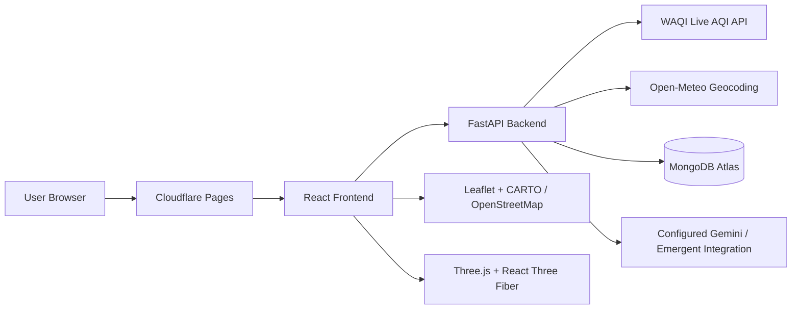

<div align="center">


<br/>

<p align="center">
  
  
  
  
</p>
<p align="center">
  
  
  
  
</p>
<p align="center">
  
  
  
  
</p>

<br/>

> **A full-stack air-quality intelligence platform that transforms live monitoring-station data into understandable AQI, pollutant insights, environmental health-risk scoring, exposure guidance, forecasts and practical precautions.**

<br/>

<p align="center">
  <a href="https://oxyzen1.pages.dev">
    
  </a>
  &nbsp;
  <a href="https://oxyzen-backend-5nvw.onrender.com/docs">
    
  </a>
  &nbsp;
  <a href="https://github.com/pranavreddy1721/oxyzen">
    
  </a>
</p>

</div>

---

## 📋 Table of Contents

- [✨ Overview](#-overview)
- [🎯 Project Goals](#-project-goals)
- [🚀 Features](#-features)
- [📡 Live AQI Data Pipeline](#-live-aqi-data-pipeline)
- [📍 Location & Station Resolution](#-location--station-resolution)
- [🧪 Pollutant Data](#-pollutant-data)
- [📊 AQI & Health-Risk Model](#-aqi--health-risk-model)
- [🔌 API Reference](#-api-reference)
- [🏗️ System Architecture](#️-system-architecture)
- [🛠️ Technology Stack](#️-technology-stack)
- [🗂️ Project Structure](#️-project-structure)
- [⚙️ Configuration](#️-configuration)
- [☁️ Deployment](#️-deployment)
- [💻 Local Development](#-local-development)
- [🔐 Security & Data Handling](#-security--data-handling)
- [⚠️ Data & Medical Disclaimer](#️-data--medical-disclaimer)
- [📄 License](#-license)

---

## ✨ Overview

**OXYZEN** is a React + FastAPI web application designed to make air-quality information easier to understand and act upon.

The platform does more than display a single AQI number. It connects a selected location to live WAQI monitoring data, presents pollutant AQI sub-indices, calculates an explainable environmental health-risk indicator, provides activity/exposure guidance, displays available forecasts, and gives users educational information through a dedicated interface and OxyZen AI assistant.

The core product flow is:

```text
        MONITOR
           │
           ▼
        ANALYZE
           │
           ▼
        PREDICT
           │
           ▼
        PROTECT
```

| Stage | OXYZEN responsibility |
|---|---|
| **Monitor** | Retrieve current live AQI from an appropriate WAQI monitoring feed. |
| **Analyze** | Present pollutant AQI sub-indices and the dominant pollutant when supplied. |
| **Predict** | Calculate an environmental health-risk awareness score and show available forecasts. |
| **Protect** | Translate air-quality conditions into exposure and activity guidance. |

---

## 🎯 Project Goals

OXYZEN is built around four practical goals:

- **Make AQI understandable** — present air quality with categories, pollutant context and plain-language guidance.
- **Use real monitoring data** — obtain live observations through WAQI instead of inventing or statically storing current AQI values.
- **Keep the source transparent** — show the monitoring station, provider, originating agency and distance when available.
- **Separate data from interpretation** — distinguish the provider's AQI from OXYZEN's own environmental health-risk indicator.

---

## 🚀 Features

<table>
<tr>
<td width="50%">

### 🌐 Live Air Quality

- Current AQI from **World Air Quality Index (WAQI)**
- Location-aware station resolution
- WAQI provider and source attribution
- Monitoring-station coordinates
- Station distance from selected location
- Direct vs nearby/associated source indication
- 0–500 AQI presentation scale

</td>
<td width="50%">

### 🗺️ Location Intelligence

- Curated city catalogue
- Global Open-Meteo geocoding fallback
- Latitude/longitude location handling
- Reverse location resolution
- Global WAQI map data
- Interactive Leaflet map
- Interactive Three.js globe

</td>
</tr>
<tr>
<td width="50%">

### 🧪 Pollutant Insights

- PM2.5
- PM10
- O₃
- NO₂
- SO₂
- CO
- Pollutant AQI sub-index presentation
- Dominant-pollutant identification when supplied

</td>
<td width="50%">

### 🧠 Environmental Health Risk

- 0–100 awareness score
- Low → Severe risk bands
- Weighted AQI/pollutant contribution model
- Main contributing factors
- Health-impact context
- Practical precautions

</td>
</tr>
<tr>
<td width="50%">

### 🏃 Exposure & Activity

- Indoor/outdoor context
- Activity intensity adjustment
- Duration adjustment
- Walking guidance
- Running guidance
- Cycling guidance
- Outdoor-sport guidance

</td>
<td width="50%">

### 🔮 Forecasting

- WAQI forecast data when available
- 2–7 day API range
- Multi-day forecast presentation
- AQI category and trend information
- Forecast source attribution

</td>
</tr>
<tr>
<td width="50%">

### 👤 User Accounts

- Registration
- Login / logout
- Secure authentication cookies
- Saved locations
- Dashboard data
- AQI alert threshold preferences

</td>
<td width="50%">

### 🤖 OxyZen AI

- Air-quality-focused assistant
- Current location/AQI context
- Streaming responses
- Session-based chat history
- Non-diagnostic health language
- Practical, plain-language explanations

</td>
</tr>
</table>

<br/>

---

## 📡 Live AQI Data Pipeline

OXYZEN uses **WAQI as the live AQI provider**. The browser does **not** call WAQI directly. Instead, the FastAPI backend performs the provider request, validates the result, normalizes the data and returns a controlled application response to the React frontend.

```text
┌─────────────────────────┐
│       User Browser      │
│       React / UI        │
└────────────┬────────────┘
             │
             ▼
┌─────────────────────────┐
│   GET /api/aqi/current  │
│      FastAPI Backend    │
└────────────┬────────────┘
             │
             ▼
┌─────────────────────────┐
│    Location Resolver    │
├─────────────────────────┤
│ Known WAQI station      │
│ Named WAQI feed         │
│ WAQI geo query          │
│ WAQI map fallback       │
└────────────┬────────────┘
             │
             ▼
┌─────────────────────────┐
│       WAQI Feed         │
│ AQI + IAQI + metadata   │
└────────────┬────────────┘
             │
             ▼
┌─────────────────────────┐
│   Runtime normalization │
│ AQI + pollutant values  │
│ source + station info   │
└────────────┬────────────┘
             │
             ▼
┌─────────────────────────┐
│       AQI Monitor       │
│ Cards • Risk • Guidance │
└─────────────────────────┘
```

### 🔄 Resolution priority

For a selected location, the backend attempts sources in a controlled order:

1. **Known WAQI station mapping** — preferred for supported cities.
2. **Named WAQI city feed** — attempts the selected city directly.
3. **WAQI geographic feed** — searches by selected coordinates.
4. **WAQI map/station fallback** — searches nearby stations within the configured distance limit.

This approach avoids silently treating an unrelated remote station as the selected location.

---

## 📍 Location & Station Resolution

### Known station mappings

The current backend contains explicit WAQI station mappings for locations where a known station is preferred:

| Location | WAQI station ID(s) | Resolution behaviour |
|---|---|---|
| **Sangli** | `A568009` | Preferred direct WAQI-associated station |
| **Kolhapur** | `A567994`, `A567991` | Tries the mapped stations in order |

### Sangli example

For **Sangli**, OXYZEN can use:

> **Vijay Nagar, Sangli / Hanchinala — WAQI station A568009**

This station is an associated/nearby monitoring station rather than an exact mathematical city-centre measurement. Therefore OXYZEN exposes the station and distance in the **Live Data Source** panel instead of presenting the reading as a city-wide average.

Example UI metadata:

```text
Selected location:  Sangli
Monitoring station: Vijay Nagar, Sangli
Provider:           World Air Quality Index (WAQI)
Data type:          Nearby/associated monitoring station
Distance:           ~45.3 km
```

The displayed AQI is therefore the **current reading from the selected monitoring station**, not a manually calculated city average.

### Distance protection

Geographic and map-based fallback stations are checked against a maximum configured station distance of **100 km**. If a station is farther away, the backend rejects it rather than silently assigning the remote station to the selected location.

---

## 🧪 Pollutant Data

OXYZEN currently works with six WAQI pollutant AQI sub-indices:

| Pollutant | API key | Representation |
|---|---|---|
| **PM2.5** | `pm25` | WAQI pollutant AQI sub-index |
| **PM10** | `pm10` | WAQI pollutant AQI sub-index |
| **Ozone** | `o3` | WAQI pollutant AQI sub-index |
| **Nitrogen dioxide** | `no2` | WAQI pollutant AQI sub-index |
| **Sulfur dioxide** | `so2` | WAQI pollutant AQI sub-index |
| **Carbon monoxide** | `co` | WAQI pollutant AQI sub-index |

> **Important:** these values are currently represented as **AQI sub-indices**, not raw pollutant concentrations such as µg/m³. The UI and API documentation maintain this distinction.

### Why this matters

For example:

```text
Overall AQI        → 23
PM2.5 sub-index    → pollutant-specific AQI contribution
PM10 sub-index     → pollutant-specific AQI contribution
O₃ sub-index       → pollutant-specific AQI contribution
```

The **overall AQI** and the OXYZEN **health-risk score** are separate metrics. The risk score is an application-level interpretation of current AQI and available pollutant sub-indices; it is not another provider AQI.

---

## 📊 AQI & Health-Risk Model

### AQI Categories

OXYZEN presents live AQI using the following application scale:

| AQI | Category |
|---:|---|
| `0–50` | 🟢 **Good** |
| `51–100` | 🟡 **Moderate** |
| `101–150` | 🟠 **Unhealthy for Sensitive Groups** |
| `151–200` | 🔴 **Unhealthy** |
| `201–300` | 🟣 **Very Unhealthy** |
| `301–500` | 🟥 **Hazardous** |

The provider value is normalized at runtime and constrained to the application's `0–500` presentation range.

### 🧠 Environmental Health-Risk Score

The health-risk score is an **OXYZEN awareness indicator**, not a medical diagnosis or clinical assessment.

The configured weighted model uses:

```text
Overall AQI   24%
PM2.5         34%
PM10          14%
O₃            12%
NO₂            8%
SO₂            5%
CO             3%
```

Risk bands:

| Score | Level |
|---:|---|
| `0–20` | 🟢 LOW |
| `21–40` | 🟡 MODERATE |
| `41–60` | 🟠 ELEVATED |
| `61–80` | 🔴 HIGH |
| `81–100` | 🟣 SEVERE |

### AQI vs Health Risk

These values are intentionally different:

| Value | Meaning |
|---:|---|
| **23 AQI** | Current air-quality index from the WAQI monitoring feed. |
| **14 Health Risk** | OXYZEN's calculated environmental health-risk awareness score. |

Therefore, an AQI of 23 and a health-risk score of 14 are **not contradictory**.

---

## 🛡️ AQI Normalization & Reliability

The current production integration includes additional protection around WAQI's numeric response formats.

### Numeric AQI handling

The backend runtime accepts AQI values represented as:

```text
23
23.0
"23"
"23.0"
```

The value is normalized before the application uses it as an integer AQI.

This specifically prevents the earlier failure caused by attempting to convert a value such as:

```text
int("23.0")
```

which can otherwise raise a `ValueError` and produce an HTTP 500 response.

### Missing aggregate AQI

When an aggregate AQI is unavailable but usable pollutant AQI sub-indices exist, the runtime can derive a fallback AQI from the highest available pollutant sub-index rather than immediately failing the current-data request.

The distinction between provider AQI and application-derived fallback remains identifiable internally.

### Source transparency

Current AQI responses can include:

- Provider name
- Provider URL
- Monitoring station name
- Station URL when supplied
- Originating/source agency
- Station latitude/longitude
- Distance from selected location
- Direct/nearby match type
- Data type description
- Provider update timestamp

The frontend exposes the relevant fields through **Live Data Source**.

---

## 🔌 API Reference

### Production API

```text
Base URL
https://oxyzen-backend-5nvw.onrender.com/api
```

### Interactive documentation

```text
https://oxyzen-backend-5nvw.onrender.com/docs
```

---

### 📍 Location APIs

| Method | Endpoint | Description |
|---|---|---|
| `GET` | `/api/location/search` | Search curated and Open-Meteo locations. |
| `GET` | `/api/location/reverse` | Resolve a location from latitude/longitude. |

#### Search parameters

| Parameter | Example | Purpose |
|---|---|---|
| `q` | `Sangli` | Search text. |
| `limit` | `8` | Maximum returned locations, capped by backend logic. |

---

### 🌐 AQI APIs

| Method | Endpoint | Description |
|---|---|---|
| `GET` | `/api/aqi/current` | Current AQI, pollutant sub-indices and source metadata. |
| `GET` | `/api/aqi/history` | Historical-data interface. |
| `GET` | `/api/aqi/forecast` | WAQI-based forecast data when available. |
| `GET` | `/api/aqi/pollutant/{pollutant}` | Pollutant details and severity. |
| `GET` | `/api/map` | Global WAQI station/map overview. |

#### Common AQI query parameters

```text
locationId
lat
lon
locationName
locationCountry
```

`/api/aqi/forecast` additionally accepts:

```text
days = 2–7
```

The backend constrains the requested forecast range to its supported `2–7` day interval.

#### Example current response shape

```json
{
  "location": {
    "id": "sangli",
    "name": "Sangli",
    "country": "India"
  },
  "aqi": 23,
  "category": "Good",
  "dominantPollutant": "pm25",
  "pollutants": {
    "pm25": 23,
    "pm10": 20,
    "o3": 7
  },
  "source": {
    "provider": "World Air Quality Index (WAQI)",
    "station": "Vijay Nagar, Sangli"
  }
}
```

> The example is illustrative; live values change with the monitoring station and update time.

---

### 🩺 Health & Exposure APIs

| Method | Endpoint | Description |
|---|---|---|
| `GET` | `/api/health-risk` | Calculates the OXYZEN environmental health-risk indicator. |
| `POST` | `/api/exposure` | Returns activity/exposure guidance for the supplied AQI and context. |

#### Exposure request fields

```json
{
  "aqi": 23,
  "environment": "outdoor",
  "activity": "resting",
  "duration": "1-3h"
}
```

---

### 👤 Authentication & User APIs

| Method | Endpoint | Description |
|---|---|---|
| `POST` | `/api/auth/register` | Create a user account. |
| `POST` | `/api/auth/login` | Authenticate a user. |
| `POST` | `/api/auth/logout` | Clear authentication cookies. |
| `GET` | `/api/auth/me` | Return the authenticated user. |
| `POST` | `/api/auth/refresh` | Refresh the access token. |
| `PATCH` | `/api/auth/alerts` | Update AQI alert preferences. |
| `GET` | `/api/users/locations` | List saved locations. |
| `POST` | `/api/users/locations` | Save a location. |
| `DELETE` | `/api/users/locations/{loc_id}` | Delete a saved location. |
| `GET` | `/api/users/dashboard` | Return saved locations, recent AQI records and alert settings. |

---

### 🤖 AI APIs

| Method | Endpoint | Description |
|---|---|---|
| `POST` | `/api/ai/chat` | Streaming OxyZen AI conversation. |
| `GET` | `/api/ai/history/{session_id}` | Retrieve chat messages for a session. |

The AI endpoint can receive current context such as location, AQI, dominant pollutant and health-risk level. The assistant is instructed to use non-diagnostic language and provide general environmental-health information.

---

### 🩺 Health-related terminology

OXYZEN deliberately uses the term **environmental health-risk awareness indicator** rather than presenting the score as a clinical diagnosis.

---

## 🏗️ System Architecture



### Production layers

| Layer | Technology | Responsibility |
|---|---|---|
| Frontend hosting | **Cloudflare Pages** | Serves the React production application. |
| Frontend | **React 19** | UI, routing, state and user interaction. |
| API | **FastAPI + Uvicorn** | REST endpoints, authentication and AQI orchestration. |
| AQI provider | **WAQI** | Live station AQI, pollutant sub-indices and available forecasts. |
| Geocoding | **Open-Meteo** | Server-side global location search fallback. |
| Database | **MongoDB Atlas** | Users, saved locations, AQI records and health-risk records. |
| AI | **Configured Gemini/Emergent integration** | OxyZen AI conversational assistant. |
| Maps | **Leaflet + CARTO/OpenStreetMap** | Interactive pollution map. |
| 3D | **Three.js + React Three Fiber** | Interactive Earth/globe experience. |

> **OpenWeather is not used by the current OXYZEN AQI pipeline.**

---

## 🛠️ Technology Stack

### 🖥️ Frontend

<p align="center">
  
  
  
  
</p>

| Technology | Purpose |
|---|---|
| **React 19** | Component-based single-page application. |
| **React Router DOM** | Client-side routing. |
| **Axios** | REST API communication. |
| **Tailwind CSS** | Utility-first styling. |
| **Recharts** | AQI and analytics visualization. |
| **Leaflet / React Leaflet** | Interactive map. |
| **Three.js / React Three Fiber** | Interactive 3D globe. |
| **Framer Motion** | UI motion and transitions. |
| **Lucide React** | Interface icons. |
| **next-themes** | Theme handling. |
| **Sonner** | Toast notifications. |
| **React Hook Form / Zod** | Form handling and validation. |

### ⚙️ Backend

<p align="center">
  
  
  
  
</p>

| Technology | Purpose |
|---|---|
| **Python 3.11** | Backend runtime. |
| **FastAPI** | REST API framework. |
| **Uvicorn** | ASGI application server. |
| **Pydantic** | Request and data validation. |
| **Motor / PyMongo** | MongoDB integration. |
| **bcrypt** | Password hashing. |
| **PyJWT** | JWT authentication. |
| **Requests** | External HTTP API communication. |
| **Pandas / NumPy** | Data-processing dependencies. |
| **pytest** | Test framework available in the project. |

### ☁️ Cloud & External Services

| Service | Role |
|---|---|
| **Cloudflare Pages** | Production frontend hosting. |
| **Render** | Dockerized FastAPI backend hosting. |
| **MongoDB Atlas** | Managed database. |
| **WAQI** | Live AQI/station data and forecast source. |
| **Open-Meteo Geocoding** | Global location search fallback. |
| **Gemini / Emergent integration** | AI assistant backend. |
| **CARTO / OpenStreetMap** | Map tile sources. |

---

## 🗂️ Project Structure

```text
oxyzen/
│
├── 📁 frontend/
│   ├── 📁 public/
│   │   └── textures/                  # Globe assets
│   │
│   ├── 📁 src/
│   │   ├── 📁 components/
│   │   │   ├── AIAssistant.jsx        # OxyZen AI assistant
│   │   │   ├── AQICard.jsx             # Main AQI card + source metadata
│   │   │   ├── AQIChart.jsx            # AQI visualization
│   │   │   ├── AQIScale.jsx            # AQI category scale
│   │   │   ├── ActivityGuidance.jsx    # Activity recommendations
│   │   │   ├── EarthGlobe.jsx           # 3D Earth
│   │   │   ├── ExposureContext.jsx      # Exposure calculator/context
│   │   │   ├── ForecastPanel.jsx        # Forecast cards
│   │   │   ├── HealthRiskCard.jsx       # Risk score + contributors
│   │   │   ├── LocationSearch.jsx       # Location search
│   │   │   ├── Navbar.jsx               # Navigation
│   │   │   ├── PollutantGrid.jsx        # Pollutant cards
│   │   │   └── ui/                      # Reusable UI primitives
│   │   │
│   │   ├── 📁 context/
│   │   │   ├── AuthContext.jsx          # Authentication state
│   │   │   └── LocationContext.jsx      # Selected location state
│   │   │
│   │   ├── 📁 pages/
│   │   │   ├── AQIMonitor.jsx           # Main AQI monitoring page
│   │   │   ├── AQIInfo.jsx              # AQI education
│   │   │   ├── HealthTips.jsx           # Health guidance
│   │   │   ├── Masks.jsx                # Mask education
│   │   │   └── ...
│   │   │
│   │   └── App.js                       # React application root
│   │
│   ├── package.json                     # Frontend dependencies/scripts
│   └── package-lock.json
│
├── 📁 backend/
│   ├── aqi_data.py                      # WAQI adapter + location resolution
│   ├── auth.py                           # Password/JWT helpers
│   ├── health_risk.py                    # Risk + exposure calculations
│   ├── server.py                         # Main FastAPI application
│   ├── waqi_server.py                    # Render entrypoint
│   ├── Dockerfile                        # Production backend image
│   ├── render.yaml                       # Render service configuration
│   ├── requirements.txt                  # Python dependencies
│   └── 📁 tests/                         # Backend tests
│
├── design_guidelines.json               # UI/design configuration
└── README.md                            # Project documentation
```

### Render entrypoint

`backend/waqi_server.py` is intentionally thin:

```python
from server import app
```

The production server therefore uses one FastAPI application rather than maintaining a second AQI routing implementation.

---

## ⚙️ Configuration

Backend secrets belong **only on the backend service**.

### Required/typical backend variables

```env
MONGO_URL=<MongoDB connection string>
DB_NAME=oxyzen
JWT_SECRET=<strong secret>
WAQI_TOKEN=<WAQI API token>
EMERGENT_LLM_KEY=<LLM integration key>
AI_MODEL_PROVIDER=gemini
AI_MODEL_NAME=<configured model>
```

Depending on the deployment configuration, the backend can also use:

```env
CORS_ORIGINS=<allowed frontend origins>
ADMIN_EMAIL=<admin email>
ADMIN_PASSWORD=<admin password>
```

### 🔒 Never commit secrets

```text
❌ WAQI_TOKEN
❌ MONGO_URL credentials
❌ JWT_SECRET
❌ EMERGENT_LLM_KEY
❌ ADMIN_PASSWORD
```

Keep them in Render environment variables or an appropriate local `.env` file that is excluded from Git.

---

## ☁️ Deployment

### 🌐 Frontend — Cloudflare Pages

Production frontend:

```text
https://oxyzen1.pages.dev
```

The React application is built using the project's CRACO configuration and deployed as the frontend production site.

### ⚙️ Backend — Render

Production backend:

```text
https://oxyzen-backend-5nvw.onrender.com
```

The backend runs from Docker using:

```text
waqi_server:app
```

The current production deployment includes the WAQI AQI normalization/resilience changes described above.

### 🗄️ Database — MongoDB Atlas

MongoDB Atlas stores application data including:

- User accounts
- Saved locations
- AQI records
- Health-risk records
- AI chat messages

### 🔄 Deployment flow

```text
GitHub main
    │
    ├──────────────► Cloudflare Pages
    │                  └── React frontend
    │
    └──────────────► Render
                       └── Docker + FastAPI
                              │
                              ├── WAQI
                              ├── Open-Meteo
                              ├── MongoDB Atlas
                              └── AI integration
```

---

## 💻 Local Development

### Prerequisites

- Node.js + npm
- Python 3.11
- MongoDB connection
- WAQI API token
- LLM integration key if AI functionality is required

### 1️⃣ Clone the repository

```bash
git clone https://github.com/pranavreddy1721/oxyzen.git
cd oxyzen
```

### 2️⃣ Backend setup

```bash
cd backend
python -m venv .venv
```

Activate the environment and install dependencies:

```bash
pip install -r requirements.txt
```

Set the required backend environment variables, then run:

```bash
uvicorn waqi_server:app --host 0.0.0.0 --port 8000
```

### 3️⃣ Frontend setup

Open another terminal:

```bash
cd frontend
npm install
npm start
```

The frontend development server will use the project's configured API setup.

### 4️⃣ Production frontend build

```bash
npm run build
```

### Frontend scripts

| Command | Purpose |
|---|---|
| `npm start` | Start CRACO development server. |
| `npm run build` | Create production frontend build. |
| `npm test` | Run the configured frontend test command. |

---

## 🔐 Security & Data Handling

OXYZEN keeps sensitive provider and authentication credentials on the server side.

- ✅ WAQI token remains server-side.
- ✅ MongoDB credentials remain server-side.
- ✅ JWT secret remains server-side.
- ✅ LLM integration key remains server-side.
- ✅ Authentication uses secure HTTP-only cookies in production.
- ✅ Saved-location and dashboard routes require authentication.
- ✅ Provider credentials are never required in the React browser client.
- ✅ User-specific AQI/history records are associated with authenticated users where applicable.

### Authentication flow

```text
Register / Login
      │
      ▼
FastAPI validates credentials
      │
      ▼
Access + refresh tokens
      │
      ▼
Secure HTTP-only cookies
      │
      ▼
Authenticated API requests
```

---

## 📚 Data Notes

### Live data is station-based

The application should be understood as a **monitoring-station-based AQI platform**, not a city-wide pollution averaging engine.

If a selected city does not have a directly suitable WAQI station, OXYZEN may use an associated nearby station and explicitly expose that relationship in the UI.

### AQI is time-sensitive

A live AQI value can change between:

- OXYZEN
- WAQI
- another AQI website
- two different monitoring stations
- two different times of the same day

Therefore, a different number does not automatically mean that one source is incorrect.

### Historical endpoint

The `/api/aqi/history` route exists as part of the API interface, and current AQI observations are logged to MongoDB for application records. The current `aqi_data.history()` implementation does not yet return a populated historical series, so clients should not assume that the endpoint currently provides a full historical chart dataset.

---

## ⚠️ Data & Medical Disclaimer

OXYZEN is an **educational and environmental-awareness application**.

- AQI data are supplied through WAQI monitoring feeds.
- Monitoring-station data can change over time and may differ between stations.
- OXYZEN's health-risk score is an awareness indicator, **not a medical diagnosis**.
- Activity and exposure guidance is general information and not individualized medical advice.
- Users with health concerns should consult an appropriately qualified healthcare professional.
- The application should not be used as a substitute for emergency or clinical care.

### WAQI attribution

OXYZEN uses the **World Air Quality Index (WAQI)** as its live AQI provider. Provider attribution is surfaced in the application wherever current station data are presented.

---

## 🧭 Current Production Status

| Component | Status |
|---|---|
| React frontend | 🟢 Live |
| FastAPI backend | 🟢 Live |
| WAQI live AQI | 🟢 Integrated |
| Station/source metadata | 🟢 Integrated |
| AQI numeric normalization | 🟢 Integrated |
| Health-risk calculation | 🟢 Integrated |
| Exposure guidance | 🟢 Integrated |
| WAQI forecast integration | 🟢 Integrated when data available |
| MongoDB Atlas | 🟢 Integrated |
| Authentication | 🟢 Integrated |
| OxyZen AI | 🟢 Integrated through configured LLM service |
| OpenWeather | ⚪ Not used |

---

## 📄 License

```text
MIT License

Copyright (c) OXYZEN

Permission is hereby granted, free of charge, to any person obtaining a copy
of this software and associated documentation files, to deal in the Software
without restriction, including without limitation the rights to use, copy,
modify, merge, publish, distribute, sublicense, and/or sell copies of the
Software, and to permit persons to whom the Software is furnished to do so,
subject to the following conditions:

The above copyright notice and this permission notice shall be included in all
copies or substantial portions of the Software.

THE SOFTWARE IS PROVIDED "AS IS", WITHOUT WARRANTY OF ANY KIND, EXPRESS OR
IMPLIED, INCLUDING BUT NOT LIMITED TO THE WARRANTIES OF MERCHANTABILITY,
FITNESS FOR A PARTICULAR PURPOSE AND NONINFRINGEMENT. IN NO EVENT SHALL THE
AUTHORS OR COPYRIGHT HOLDERS BE LIABLE FOR ANY CLAIM, DAMAGES OR OTHER
LIABILITY, WHETHER IN AN ACTION OF CONTRACT, TORT OR OTHERWISE, ARISING FROM,
OUT OF OR IN CONNECTION WITH THE SOFTWARE OR THE USE OR OTHER DEALINGS IN THE
SOFTWARE.
```

---

<div align="center">

<br/>

### 🌱 OXYZEN

**Understand Your Air • Understand Your Health**

<br/>

<a href="https://oxyzen1.pages.dev">
  
</a>

<br/><br/>

*Built as a full-stack environmental engineering project focused on turning air-quality data into useful, understandable information.*

</div>
