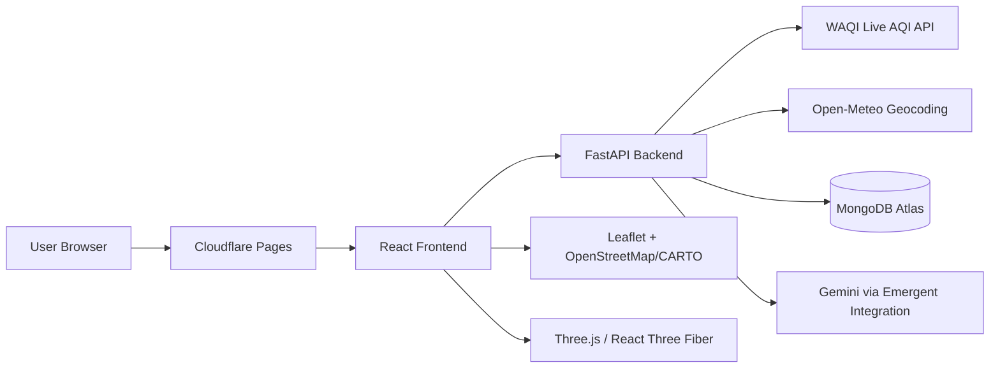

<div align="center">


<br/>

<p>
  
  
  
  
</p>
<p>
  
  
  
  
  
</p>
<p>
  
  
  
  
</p>

<br/>

> **A full-stack air-quality intelligence platform that turns live pollution data into understandable AQI, pollutant insights, environmental health-risk scoring, exposure guidance, forecasts and actionable precautions.**

<br/>

[🚀 Live Demo](https://oxyzen1.pages.dev) &nbsp;•&nbsp; [📚 API Docs](https://oxyzen-backend-5nvw.onrender.com/docs) &nbsp;•&nbsp; [🐛 Report Bug](https://github.com/pranavreddy1721/oxyzen/issues) &nbsp;•&nbsp; [💡 Request Feature](https://github.com/pranavreddy1721/oxyzen/issues)

<br/>

</div>

---

## 📋 Table of Contents

- [✨ Overview](#-overview)
- [🌍 What OXYZEN Does](#-what-oxyzen-does)
- [🚀 Features](#-features)
- [📊 AQI & Risk Model](#-aqi--risk-model)
- [🧩 System Architecture](#-system-architecture)
- [🛠️ Tech Stack](#️-tech-stack)
- [🗂️ Project Structure](#️-project-structure)
- [🔌 API Endpoints](#-api-endpoints)
- [🔐 Authentication](#-authentication)
- [⚙️ Environment Variables](#️-environment-variables)
- [☁️ Deployment](#️-deployment)
- [💻 Getting Started](#-getting-started)
- [📱 Responsive Design](#-responsive-design)
- [🔒 Security](#-security)
- [⚠️ Data & Medical Disclaimer](#️-data--medical-disclaimer)
- [🤝 Contributing](#-contributing)
- [📄 License](#-license)

---

## ✨ Overview

**OXYZEN** is a full-stack web application focused on making air-quality information easier to understand and act on.

Instead of presenting only a single AQI number, OXYZEN combines live air-quality observations with pollutant-level context, an explainable environmental health-risk score, activity guidance, exposure calculations, forecasts, educational resources and an AI assistant.

The application is designed around four simple ideas:

```text
MONITOR  →  ANALYZE  →  PREDICT  →  PROTECT
```

- **Monitor** — retrieve live AQI information for a selected location.
- **Analyze** — break down available pollutant AQI sub-indices.
- **Predict** — provide an explainable environmental health-risk indicator and available forecast information.
- **Protect** — translate conditions into practical exposure and activity guidance.

---

## 🌍 What OXYZEN Does

<table>
<tr>
<td width="50%">

### 🌐 Live Air Quality

- Current AQI from **World Air Quality Index (WAQI)**
- Selected-city aware location handling
- WAQI station/source attribution
- Six pollutant AQI sub-indices when available
- US EPA-style AQI category presentation

</td>
<td width="50%">

### 🗺️ Location Intelligence

- Worldwide location search
- Open-Meteo geocoding fallback
- Latitude/longitude based lookup
- Global live pollution map
- Interactive 3D Earth visualization

</td>
</tr>
<tr>
<td width="50%">

### 🧠 Explainable Health Risk

- Environmental health-risk score from 0–100
- Five risk bands: Low → Severe
- Weighted AQI and pollutant contribution model
- Main-contributor breakdown
- Health-impact and precaution guidance

</td>
<td width="50%">

### 🏃 Exposure & Activity

- Outdoor/indoor exposure context
- Activity intensity adjustment
- Duration adjustment
- Walking, running, cycling and outdoor-sport guidance
- Practical exposure-reduction suggestions

</td>
</tr>
<tr>
<td width="50%">

### 🔮 Forecasting

- Available WAQI pollutant forecasts
- Multi-day forecast cards
- AQI category and trend presentation
- Forecast values derived from available pollutant forecast sub-indices

</td>
<td width="50%">

### 🤖 OxyZen AI

- Context-aware air-quality assistant
- Current location and AQI context
- Streaming responses
- Questions about pollutants, health impacts and precautions
- Session-based chat handling

</td>
</tr>
<tr>
<td width="50%">

### 👤 User Dashboard

- Account registration and login
- Saved locations
- Recent searches
- AQI alert threshold
- Enable/disable alerts

</td>
<td width="50%">

### 📚 Education

- AQI fundamentals
- Six major pollutants
- Pollution and weather factors
- Health tips
- Mask and particulate-filtration information

</td>
</tr>
</table>

---

## 🚀 Features

### 📡 Real-Time AQI Pipeline

OXYZEN retrieves current air-quality observations through the WAQI API. The backend resolves the user's selected location, retrieves an appropriate WAQI feed, validates that a usable AQI is available and exposes the provider source separately from the selected UI location.

For locations with known WAQI/CPCB station mappings, direct station feeds are preferred before geographic and nearby-station fallbacks.

### 🧪 Six Pollutants

| Pollutant | Key | OXYZEN Representation |
|---|---|---|
| PM2.5 | `pm25` | WAQI AQI sub-index |
| PM10 | `pm10` | WAQI AQI sub-index |
| Ozone | `o3` | WAQI AQI sub-index |
| Nitrogen dioxide | `no2` | WAQI AQI sub-index |
| Sulfur dioxide | `so2` | WAQI AQI sub-index |
| Carbon monoxide | `co` | WAQI AQI sub-index |

> **Important:** the pollutant values supplied by the current WAQI integration are pollutant **AQI sub-indices**, not raw concentration measurements such as µg/m³. OXYZEN keeps that distinction explicit in its UI and backend model.

### 📈 Data Visualization

OXYZEN uses responsive visual components rather than dumping raw API responses onto the page:

- AQI category scale
- AQI area-chart component where applicable
- Pollutant comparison cards
- Risk contribution visualization
- Forecast cards with trend indicators
- Global interactive map
- Interactive 3D Earth/globe visualization

---

## 📊 AQI & Risk Model

### AQI Categories

OXYZEN presents the following AQI bands:

| AQI | Category |
|---:|---|
| `0–50` | 🟢 Good |
| `51–100` | 🟡 Moderate |
| `101–150` | 🟠 Unhealthy for Sensitive Groups |
| `151–200` | 🔴 Unhealthy |
| `201–300` | 🟣 Very Unhealthy |
| `301–500` | 🟥 Hazardous |

The current live AQI comes from WAQI and is clamped to the application's 0–500 presentation scale.

### Environmental Health-Risk Score

The risk engine produces an **awareness indicator**, not a medical diagnosis.

The model combines normalized current AQI and available pollutant sub-indices using weighted contributions:

```text
Risk Score
    │
    ├── Overall AQI              24%
    ├── PM2.5                     34%
    ├── PM10                      14%
    ├── O₃                         12%
    ├── NO₂                         8%
    ├── SO₂                         5%
    └── CO                          3%
```

Risk bands:

| Score | Level |
|---:|---|
| `0–20` | LOW |
| `21–40` | MODERATE |
| `41–60` | ELEVATED |
| `61–80` | HIGH |
| `81–100` | SEVERE |

The application also produces activity guidance for walking, running, cycling and outdoor sports based on current AQI.

---

## 🧩 System Architecture



### Production Architecture

| Layer | Technology | Responsibility |
|---|---|---|
| Frontend hosting | Cloudflare Pages | React production build and static delivery |
| Frontend | React | UI, routing, state and interaction |
| Backend | FastAPI + Uvicorn | API, auth, AQI orchestration and business logic |
| AQI provider | WAQI | Live station AQI and pollutant sub-indices |
| Geocoding | Open-Meteo | Global location search fallback |
| Database | MongoDB Atlas | Users, saved locations, dashboard/search data and application records |
| AI | Gemini through Emergent integration | Context-aware air-quality assistant |
| Maps | Leaflet + CARTO/OpenStreetMap | Global pollution map |
| 3D | Three.js + React Three Fiber | Interactive Earth visualization |

---

## 🛠️ Tech Stack

### 🖥️ Frontend

| Technology | Version | Purpose |
|---|---:|---|
|  **React** | 19.0.0 | Component-based frontend SPA |
|  **JavaScript** | ES6+ | Application logic |
| **React Router DOM** | 7.15.0 | Client-side routing |
| **Axios** | 1.18.0 | REST API client |
| **Tailwind CSS** | 3.4.17 | Utility-first styling |
| **Recharts** | 3.6.0 | Responsive data visualization |
| **Leaflet** | 1.9.4+ | Interactive maps |
| **React Leaflet** | 5.0.0+ | React map bindings |
| **Three.js** | 0.185.1+ | 3D rendering |
| **React Three Fiber** | 9.7.0+ | React renderer for Three.js |
| **Framer Motion** | 11.18.0 | UI motion and transitions |
| **Lucide React** | 0.516.0 | SVG icon system |
| **next-themes** | 0.4.6 | Dark theme handling |
| **Sonner** | 2.0.3 | Toast notifications |
| **CRACO** | 7.1.0 | Create React App configuration |

### ⚙️ Backend

| Technology | Version | Purpose |
|---|---:|---|
|  **Python** | 3.11 | Backend runtime |
| **FastAPI** | 0.110.1 | REST API framework |
| **Uvicorn** | 0.25.0 | ASGI server |
| **Pydantic** | 2.x | Request/data validation |
| **Motor** | 3.3.1 | Async MongoDB driver |
| **PyMongo** | 4.6.3 | MongoDB support |
| **bcrypt** | 4.1.3 | Password hashing |
| **PyJWT** | 2.10.1+ | JWT creation and validation |
| **Requests** | 2.31.0+ | External HTTP APIs |
| **Pandas / NumPy** | 2.2+ / 1.26+ | Data-processing dependencies |
| **pytest** | 8.0+ | Automated testing framework |

### ☁️ Cloud & External Services

| Service | Purpose |
|---|---|
| **Cloudflare Pages** | Production React hosting |
| **Render** | Dockerized FastAPI backend |
| **MongoDB Atlas** | Managed MongoDB database |
| **WAQI** | Live air-quality observations and forecasts |
| **Open-Meteo** | Global geocoding search |
| **Gemini** | AI assistant model |
| **Emergent integration** | LLM integration layer |
| **CARTO / OpenStreetMap** | Map tiles |

---

## 🗂️ Project Structure

```text
oxyzen/
│
├── frontend/                         # React frontend
│   ├── public/
│   │   ├── index.html                # HTML shell and application title
│   │   └── textures/                 # Globe textures/assets
│   │
│   ├── src/
│   │   ├── components/
│   │   │   ├── AIAssistant.jsx       # Floating OxyZen AI assistant
│   │   │   ├── AQICard.jsx            # Current AQI presentation
│   │   │   ├── AQIChart.jsx            # Recharts AQI visualization
│   │   │   ├── AQIScale.jsx             # AQI category scale
│   │   │   ├── ActivityGuidance.jsx     # Activity recommendations
│   │   │   ├── EarthGlobe.jsx            # Interactive 3D globe
│   │   │   ├── ExposureContext.jsx       # Exposure calculator UI
│   │   │   ├── ForecastPanel.jsx          # Forecast cards
│   │   │   ├── HealthRiskCard.jsx          # Risk score and contributors
│   │   │   ├── LocationSearch.jsx          # Location search interface
│   │   │   ├── Navbar.jsx                  # Responsive navigation
│   │   │   ├── PollutantGrid.jsx            # Six-pollutant UI
│   │   │   ├── ThemeToggle.jsx              # Theme switcher
│   │   │   └── ui/                         # Reusable UI primitives
│   │   │
│   │   ├── context/
│   │   │   ├── AuthContext.jsx             # Authentication state
│   │   │   └── LocationContext.jsx          # Selected location state
│   │   │
│   │   ├── lib/
│   │   │   ├── api.js                      # Axios API client
│   │   │   └── aqiColors.js                 # AQI/risk color helpers
│   │   │
│   │   ├── pages/
│   │   │   ├── Home.jsx                     # Landing page
│   │   │   ├── AQIMonitor.jsx               # Main live monitoring dashboard
│   │   │   ├── MapPage.jsx                   # Global pollution map
│   │   │   ├── AQIInfo.jsx                   # AQI education
│   │   │   ├── Tips.jsx                      # Health tips
│   │   │   ├── Masks.jsx                     # Mask education
│   │   │   ├── Login.jsx                     # Login
│   │   │   ├── Register.jsx                  # Registration
│   │   │   └── Dashboard.jsx                 # Saved locations and alerts
│   │   │
│   │   ├── App.js                            # Route definitions
│   │   ├── App.css                            # Application styles
│   │   └── index.css                          # Global styles
│   │
│   ├── craco.config.js
│   └── package.json
│
├── backend/                            # FastAPI backend
│   ├── server.py                        # Core API, auth, users and application routes
│   ├── waqi_server.py                   # Live WAQI route entrypoint
│   ├── aqi_data.py                      # WAQI adapter, geocoding and AQI helpers
│   ├── health_risk.py                   # Explainable environmental risk engine
│   ├── auth.py                           # bcrypt + JWT helpers
│   ├── Dockerfile                        # Render production image
│   ├── requirements.txt                  # Python dependencies
│   └── tests/                            # Backend tests
│
├── tests/                               # Project-level tests/assets
├── test_reports/                        # Test report artifacts
├── memory/                              # Project support data
├── worker.js                            # Cloudflare Worker deployment support
├── wrangler.jsonc                       # Wrangler configuration
├── package.json                          # Root deployment scripts
└── README.md                             # Project documentation
```

> **Documentation policy:** OXYZEN intentionally keeps **one primary README** at the repository root. Deployment information is included here instead of maintaining separate README variants.

---

## 🔌 API Endpoints

Base path: `/api`

### 🔐 Authentication

| Method | Endpoint | Auth | Description |
|---|---|---|---|
| `POST` | `/auth/register` | ❌ | Create a user account |
| `POST` | `/auth/login` | ❌ | Authenticate and issue tokens |
| `POST` | `/auth/logout` | — | Clear authentication cookies |
| `GET` | `/auth/me` | ✅ | Return current user |
| `POST` | `/auth/refresh` | Cookie | Refresh the access token |
| `PATCH` | `/auth/alerts` | ✅ | Update AQI alert preferences |

### 📍 Location

| Method | Endpoint | Auth | Description |
|---|---|---|---|
| `GET` | `/location/search` | ❌ | Search cities/locations |
| `GET` | `/location/reverse` | ❌ | Resolve coordinates to a location |

### 🌫️ Air Quality

| Method | Endpoint | Auth | Description |
|---|---|---|---|
| `GET` | `/aqi/current` | ❌ | Live AQI and pollutant sub-indices |
| `GET` | `/aqi/forecast` | ❌ | Available multi-day WAQI forecast |
| `GET` | `/aqi/pollutant/{pollutant}` | ❌ | Current pollutant sub-index details |
| `GET` | `/health-risk` | ❌ | Explainable environmental health-risk score |
| `POST` | `/exposure` | ❌ | Calculate contextual exposure guidance |
| `GET` | `/map` | ❌ | Live global map station data |

Historical AQI pages/endpoints are intentionally **not part of the current product surface**.

### 👤 Saved Locations & Dashboard

| Method | Endpoint | Auth | Description |
|---|---|---|---|
| `GET` | `/users/locations` | ✅ | List saved locations |
| `POST` | `/users/locations` | ✅ | Save a location |
| `DELETE` | `/users/locations/{id}` | ✅ | Remove a saved location |
| `GET` | `/users/dashboard` | ✅ | Dashboard data and recent searches |

### 🤖 AI

| Method | Endpoint | Auth | Description |
|---|---|---|---|
| `POST` | `/ai/chat` | ❌ | Streaming AI assistant response |
| `GET` | `/ai/history/{session_id}` | ❌ | Retrieve chat session history |

Interactive API documentation is available from FastAPI at `/docs` on the deployed backend.

---

## 🔐 Authentication

OXYZEN uses a lightweight token-based authentication flow:

```text
Register / Login
       │
       ▼
  Access Token + Refresh Token
       │
       ├── httpOnly secure cookies
       │
       └── frontend bearer token support
       │
       ▼
 Protected API endpoints
       │
       ▼
 MongoDB user lookup
```

### Token Policy

| Token | Lifetime | Purpose |
|---|---:|---|
| Access token | 7 days | Authenticated API access |
| Refresh token | 30 days | Obtain a new access token |

Passwords are hashed with **bcrypt** and never returned as part of public user data.

---

## ⚙️ Environment Variables

### Backend

Create/configure these variables on the backend service:

```env
# MongoDB
MONGO_URL=mongodb+srv://<user>:<password>@<cluster>/<database>
DB_NAME=oxyzen

# Authentication
JWT_SECRET=your_long_random_secret

# Live AQI provider
WAQI_TOKEN=your_waqi_token

# AI integration
EMERGENT_LLM_KEY=your_emergent_key
AI_MODEL_PROVIDER=gemini
AI_MODEL_NAME=gemini-3-flash-preview

# Admin bootstrap
ADMIN_EMAIL=your_admin_email
ADMIN_PASSWORD=your_admin_password

# CORS
CORS_ORIGINS=https://your-frontend-domain.example
```

### Frontend

For a direct Render backend deployment, the frontend can use:

```env
REACT_APP_BACKEND_URL=https://your-backend.example.com
```

> ⚠️ **Never commit real credentials, API tokens, MongoDB passwords or JWT secrets to Git.** Backend secrets must remain on the server/hosting platform.

---

## ☁️ Deployment

OXYZEN is structured as a split production deployment:

```text
                 ┌──────────────────────┐
                 │    Cloudflare Pages  │
                 │    React Frontend    │
                 └──────────┬───────────┘
                            │ HTTPS / REST
                            ▼
                 ┌──────────────────────┐
                 │        Render        │
                 │  FastAPI + Uvicorn  │
                 └──────┬──────┬────────┘
                        │      │
              ┌─────────┘      └───────────┐
              ▼                            ▼
      ┌───────────────┐           ┌─────────────────┐
      │ MongoDB Atlas │           │ WAQI / Open-   │
      │               │           │ Meteo / Gemini │
      └───────────────┘           └─────────────────┘
```

### Cloudflare Pages

Recommended production build settings:

| Setting | Value |
|---|---|
| Framework preset | None / Create React App |
| Root directory | `frontend` |
| Build command | `npm run build` |
| Build output directory | `build` |
| Production API variable | `REACT_APP_BACKEND_URL` |

### Render

The backend is containerized using `backend/Dockerfile` and starts with:

```bash
uvicorn waqi_server:app --host 0.0.0.0 --port 8000
```

### MongoDB Atlas

Create the `oxyzen` database and provide the backend service with a database user that has the required read/write permissions.

---

## 💻 Getting Started

### Prerequisites

```bash
node -v       # Node.js 18+ recommended
npm -v
python --version   # Python 3.11
```

### 1. Clone the repository

```bash
git clone https://github.com/pranavreddy1721/oxyzen.git
cd oxyzen
```

### 2. Install frontend dependencies

```bash
cd frontend
npm install
```

### 3. Configure the backend

```bash
cd ../backend
python -m venv .venv
```

Activate the virtual environment:

```bash
# Windows
.venv\Scripts\activate

# macOS / Linux
source .venv/bin/activate
```

Install dependencies:

```bash
pip install -r requirements.txt
```

Create `backend/.env` with the required values from the environment-variable section.

### 4. Start the backend

```bash
cd backend
uvicorn server:app --reload --host 0.0.0.0 --port 8000
```

For the production WAQI entrypoint, use:

```bash
uvicorn waqi_server:app --host 0.0.0.0 --port 8000
```

### 5. Start the frontend

In a second terminal:

```bash
cd frontend
npm start
```

The development frontend runs on the Create React App development server and calls the configured backend API.

---

## 📱 Responsive Design

The interface is built as a responsive single-page application:

| Screen | Design approach |
|---|---|
| Desktop | Multi-column dashboards, full navigation and expanded visualizations |
| Tablet | Adaptive grids and compressed navigation |
| Mobile | Stacked cards, touch-friendly controls and collapsible navigation |

Key responsive areas include:

- Mobile navigation menu
- AQI dashboard cards
- Pollutant grid
- Health-risk sections
- Global map
- 3D globe
- Login/register forms
- Dashboard saved-location cards
- Floating AI assistant

---

## 🔒 Security

| Feature | Implementation |
|---|---|
| **Password hashing** | bcrypt |
| **Access tokens** | JWT with 7-day expiry |
| **Refresh tokens** | JWT with 30-day expiry |
| **Cookie protection** | `HttpOnly`, `Secure`, `SameSite=None` in production |
| **Input validation** | Pydantic models / FastAPI validation |
| **Protected routes** | Dependency-based authenticated user resolution |
| **Secret management** | Environment variables only |
| **CORS** | Configurable allowed frontend origins |
| **API errors** | Generic client-facing failures with server-side logging |

---

## ⚠️ Data & Medical Disclaimer

### WAQI Data

OXYZEN uses the **World Air Quality Index (WAQI)** for live air-quality observations and available forecasts.

The application displays provider attribution and does not represent the data as an independently validated government measurement. WAQI pollutant values exposed through this integration are pollutant AQI sub-indices, not raw concentration measurements.

### Health Information

OXYZEN's health-risk score, activity guidance, exposure calculations, health tips and AI responses are **informational and educational only**.

They are not medical diagnoses, clinical assessments or individualized medical advice. Users should consult qualified healthcare professionals and follow applicable local public-health guidance for health decisions.

---

## 🧭 Product Scope

The current OXYZEN product intentionally focuses on:

```text
✓ Live AQI
✓ Pollutant sub-index analysis
✓ Environmental health-risk awareness
✓ Exposure guidance
✓ Activity guidance
✓ Live global map
✓ 3D Earth visualization
✓ Multi-day provider forecast
✓ Global location search
✓ User accounts
✓ Saved locations
✓ AQI alerts/preferences
✓ OxyZen AI assistant
✓ AQI education
✓ Health tips
✓ Mask education

✗ Historical AQI product page
✗ Fabricated historical data
```

This keeps the application aligned with the capabilities of the live data provider rather than generating unsupported historical values.

---

## 🤝 Contributing

Contributions are welcome.

```bash
# 1. Fork the repository

# 2. Create a feature branch
git checkout -b feature/AmazingFeature

# 3. Make your changes

# 4. Commit
git commit -m "Add AmazingFeature"

# 5. Push
git push origin feature/AmazingFeature

# 6. Open a Pull Request
```

Before submitting a PR:

- Keep the frontend responsive.
- Preserve API/provider attribution.
- Never add simulated AQI values where live data is expected.
- Never commit secrets.
- Update this README when a major architectural or product change is introduced.

---

## 📄 License

Distributed under the **MIT License**.

---

<div align="center">

**Built with ❤️ by [Pranav Reddy](https://github.com/pranavreddy1721)**

<br/>


</div>
